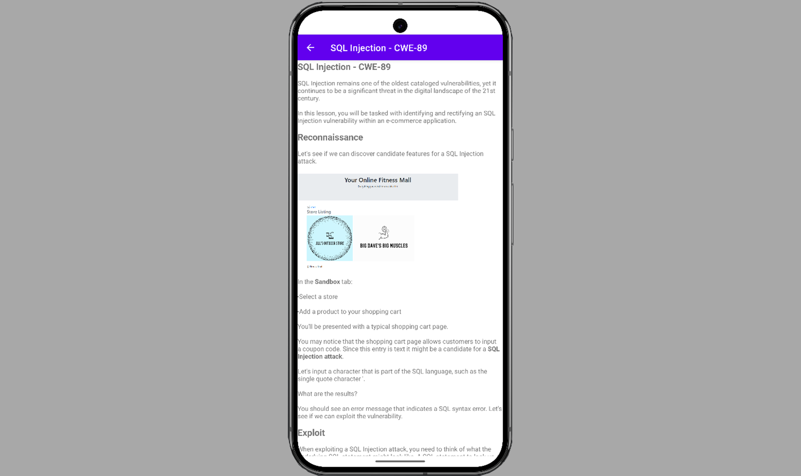
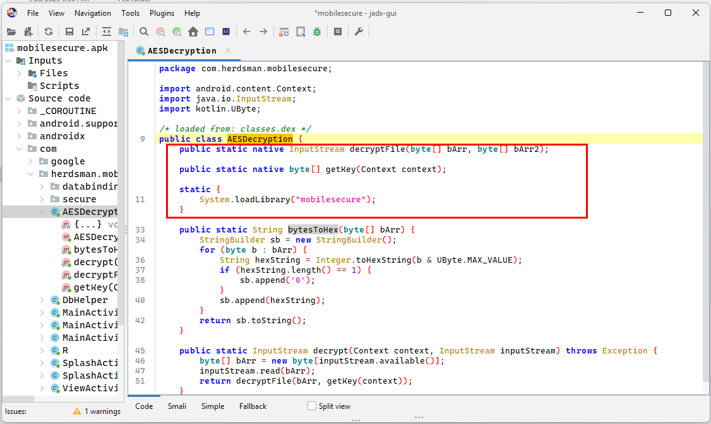

# OWASP M10: Insufficient Cryptography – Scenarios #4, #5 
**Project:** Demonstration of Risks and Secure Remediation  
**Focus Areas:**  
- Scenario #4: Key Management Vulnerabilities  
- Scenario #5: Crypto Implementation Flaws  

---

# 1. Executive Summary

In today's mobile application world, protecting sensitive user data is critical.  
This project demonstrates a real-world **cryptographic vulnerability** and shows how it can be **exploited by attackers** - and more importantly, **how we can fix it with modern best practices**.

We simulated an attack against a mobile app where secret encryption keys were exposed, allowing an attacker to decrypt protected materials.  
We then rebuilt the application with **advanced security techniques** that make such attacks **extremely difficult or impossible**.

✅ Vulnerability Demonstrated  
✅ Attack Simulated  
✅ Defense Implemented  
✅ Problem Solved

---

# 2. Business Risk

If vulnerabilities like these are present in a mobile app:

| Risk Area            | Business Impact |
|:----------------------|:----------------|
| Data Breaches         | Exposure of sensitive internal materials or customer data. |
| Intellectual Property Loss | Competitors gaining access to proprietary learning or study materials. |
| Brand Damage         | Loss of customer trust due to perceived app insecurity. |
| Legal and Compliance Violations | Failure to comply with data protection laws (GDPR, HIPAA, etc.). |
| Financial Losses      | Potential lawsuits, fines, and operational losses.|

---

# 3. What Happened in the Vulnerable App



Originally, the app protected sensitive study materials (like HTMLs, images, etc.) by encrypting them. 

However:

- The **secret encryption key was hidden inside the app** (but easily recoverable).
- The **process to decrypt the data was fully visible**.
- There was **no system to detect if the app had been tampered with**.

### Visual Overview of the Problem:

```plaintext
Attacker Downloads APK
    ↓
Uses Tools to Extract Hidden Key
    ↓
Decrypts Sensitive Offline Study Materials
```

**Result:**  
The attacker could **steal all study materials** without even needing to run the app properly.

---

# 4. Simulated Attack Steps

### 1. **Downloaded** the APK file.
### 2. **Reverse-engineered** the app to extract the hidden key.

### 3. **Ran a Python script** to decrypt all protected files.

```python
from Crypto.Cipher import AES
from Crypto.Util.Padding import unpad
import zipfile

AES_KEY = bytes.fromhex('d3cfb0650cd99568909579c59c9d14410e1bfccd77ff59a95de113bfa54b57d9')
with open('data.enc', 'rb') as f:
    encrypted_data = f.read()

iv = encrypted_data[:16]
ciphertext = encrypted_data[16:]
cipher = AES.new(AES_KEY, AES.MODE_CBC, iv)
decrypted_data = unpad(cipher.decrypt(ciphertext), AES.block_size)

with open('data.zip', 'wb') as f:
    f.write(decrypted_data)
```
### 4. **Bypassed all application protections** without any credentials.  

## 🔥Another  Attack Scenario:
1. Attacker downloads the APK file.
2. Attacker analyzes the app's code.
2. Attacker injects custom smali code to extract the encryption key during runtime, then decrypts and stores all protected databases without authorization.

**Outcome:**  
Sensitive material was stolen **within minutes**.

---

# 5. How We Fixed It (Our Defense Strategy)

### Key Solutions Applied:
- **No more static keys** inside the app.
- **Encryption key is now generated at runtime** based on:
  - Integrity (checksums) of the app's own important files.
  - Optional device information (future upgrade planned).
- **All decryption happens inside secure native code** (harder to reverse-engineer).
- **Native libraries are packed to make static analysis and reverse-engineering even more difficult.**
- **If the app is modified even slightly, the encryption will fail.**

✅ **If someone tampers with the app:**  
👉 The app notices and refuses to decrypt anything.


---

### 🔒 Visual Overview of Secure Flow:

```plaintext
User Launches App
    ↓
App Verifies Integrity of Itself (Manifest, Classes, Libraries)
    ↓
Generates a New, Safe Encryption Key Dynamically
    ↓
Safely Decrypts Study Materials
```

**Result:**  
**No static secret exists** to steal.  
**No offline attack path** for decryption.

---

# 6. Why This Approach Is Powerful

| Feature                   | Benefit |
|:---------------------------|:--------|
| Dynamic Key Generation     | No pre-stored secrets to steal. |
| App Integrity Checks       | Immediate detection if tampering happens. |
| Native Code Security       | Much harder for attackers to reverse-engineer. |
| Packed Native Libraries | Increases difficulty for attackers to reverse-engineer decryption logic.


---

# 7. Summary Table

| Item                         | Before (Vulnerable) | After (Secure) |
|:------------------------------|:-------------------|:--------------|
| Key Storage                  | Static key in app   | Runtime generated key |
| App Modification Resistance  | None                | Modification detection |
| Decryption Exposure          | Easy (offline)      | Hard (integrity checked) |


---

# 8. Final Takeaway

By addressing the critical weakness identified by **OWASP M10: Insufficient Cryptography**,  
we have dramatically strengthened the mobile app against real-world cyber threats.

✅ We protected our sensitive intellectual property.  
✅ We reduced the risk of reputational and legal harm.  
✅ We upgraded the app architecture for future resilience.

---

# 9. Appendix (For Further Reading)

- **Security Journey Training Materials**
- **OWASP Mobile Top 10 2024**

